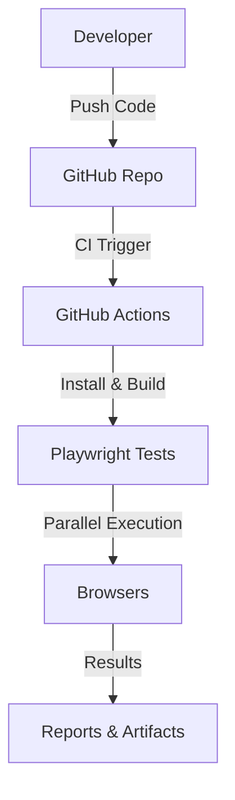

# Playwright Parallel Testing & CI Pipeline 🚀

## Tech Stack
- 
- 
- 
- 

## Architecture



## Sample Pipeline
- [Sample GitHub Actions Workflow](https://github.com/your-org/your-repo/.github/workflows/playwright.yml)

## Project Structure

```
src/
  pages/
  tests/
  utils/
.github/
  workflows/
    playwright.yml
```

## Workflow
1. Developer pushes code to GitHub.
2. GitHub Actions triggers Playwright tests in parallel.
3. Results and reports are generated and stored as artifacts.

---

# playwright-framework
Playwright End to End Automation Framework using Playwright Test Runner.

1. Uses Page Object Model
2. Junit XML Reports will be generated automatically

For Detailed Tutorial Visit https://deepakkamboj.com/

If you have any questions contact me on linkedIn https://www.linkedin.com/in/kambojdeepak/

## What is Playwright?
The playwright is a Node.js library to automate Chromium, Firefox, and WebKit with a single API. Playwright is built to enable cross-browser web testing.

Playwright by Microsoft did start as a fork of Puppeteer
Puppeteer is a node library to automate the chromium browsers with the JavaScript API
### Capabilities:
* It spans multiple pages, domains, and iframes
* Intercept network activity for stubbing and mocking network requests
* Emulate mobile devices, geolocation, permissions
* Native input events for mouse and keyboard
* Upload & download support

Playwright enables fast, reliable, and capable automation across all modern browsers

### Support for all browsers
* Test on Chromium, Firefox, and WebKit
* Test for mobile (device emulation)
* Headless and headful

### Fast and reliable execution
* Auto-wait APIs (clicks, types, etc)
* Timeout-free automation
* Lean parallelization with browser contexts
* Wide variety of selectors (locators) & shadow-dom support
* Can handle single page application

### Used tools for Playwright Integration Tests
- [playwright](https://playwright.dev/) - Playwright is a Node.js library to automate tests cases for Chromium, Firefox and WebKit with a single API
- [axe-playwright](https://www.npmjs.com/package/axe-playwright) - Analyses the page and identifies accessibility issues.
- [Playwright test runner](https://github.com/microsoft/playwright-test) - Zero config cross-browser end-to-end testing for web apps. Browser automation with Playwright, Jest-like assertions and built-in support for TypeScript.

## Getting Started

Playwright is easy to install and start to work with. Just have to create a fresh project and install the playwright as a dependency.

### Create a new project
`$ npm init -y`

### Install Playwright
`$ npm install — save-dev @playwright/test`

### Choosing Typescript as the scripting language
`$ npm install — save-dev typescript`

### Typescript config in “tsconfig.json“

```
{
  "compilerOptions": {
     "target": "es6",
     "module": "commonjs",
     "strict": true,
     "sourceMap": true
  },
  "include": ["src"]
}
```
** As per config, we should add all tests & other classes inside of the “src/” folder